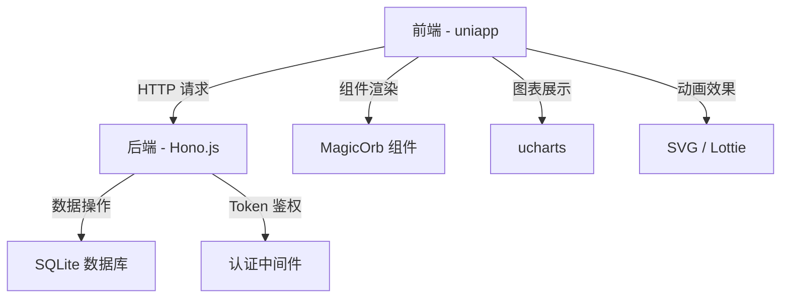
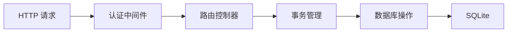
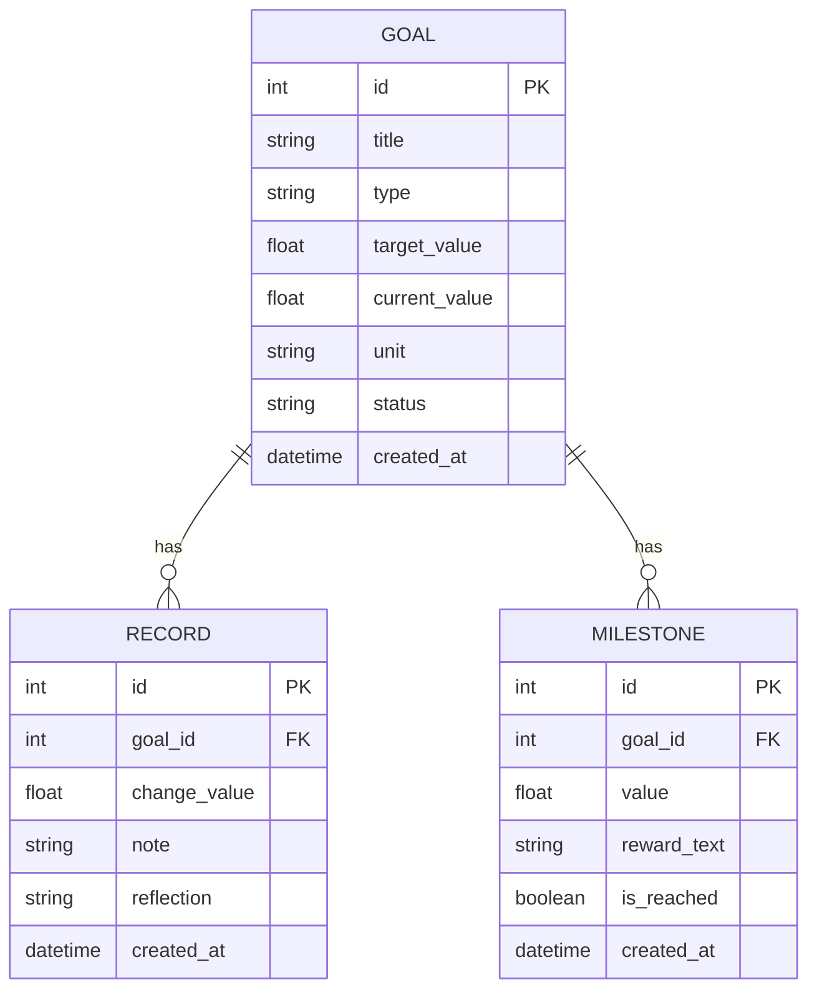

# 治愈系个人目标与进度管理 App（Lumina）技术架构文档

## 1. 架构设计
Lumina 采用前后端分离架构，后端提供 RESTful API，前端通过 uniapp 实现跨平台支持。



## 2. 技术描述
- **前端**：uniapp (Vue3 + Vite) + uni-ui + ucharts + SVG 动画
- **后端**：Node.js + Hono.js (TypeScript)
- **数据库**：SQLite (better-sqlite3)
- **样式体系**：莫兰迪色系 Design Token + 毛玻璃效果 + 大圆角无边框设计

## 3. 路由定义
| 页面路径 | 用途 |
|----------|------|
| /pages/index/index | 首页看板，展示目标列表 |
| /pages/create/create | 新建目标页面 |
| /pages/detail/detail | 目标详情页面 |
| /pages/profile/profile | 个人主页，荣誉墙和数据导出 |

## 4. API 定义

### 4.1 TypeScript 类型定义
```typescript
interface Goal {
  id: number;
  title: string;
  type: 'accumulation' | 'cycle' | 'trend';
  target_value: number;
  current_value: number;
  unit: string;
  status: 'active' | 'completed';
  created_at: string;
}

interface Record {
  id: number;
  goal_id: number;
  change_value: number;
  note: string;
  reflection: string;
  created_at: string;
}

interface Milestone {
  id: number;
  goal_id: number;
  value: number;
  reward_text: string;
  is_reached: boolean;
  created_at: string;
}
```

### 4.2 API 端点
| 方法 | 路径 | 描述 |
|------|------|------|
| GET | /goals | 获取所有目标，支持 ?status=active 过滤 |
| POST | /goals | 创建新目标 |
| PUT | /goals/:id | 更新目标信息 |
| DELETE | /goals/:id | 删除目标（级联删除记录） |
| POST | /records | 创建打卡记录 |
| DELETE | /records/:id | 删除记录并回滚进度 |
| GET | /export | 导出所有数据为 JSON |

## 5. 服务器架构图



## 6. 数据模型

### 6.1 ER 图



### 6.2 数据库初始化语句
```sql
-- 创建 goals 表
CREATE TABLE goals (
    id INTEGER PRIMARY KEY AUTOINCREMENT,
    title TEXT NOT NULL,
    type TEXT NOT NULL CHECK(type IN ('accumulation', 'cycle', 'trend')),
    target_value REAL NOT NULL,
    current_value REAL NOT NULL DEFAULT 0,
    unit TEXT NOT NULL,
    status TEXT NOT NULL DEFAULT 'active',
    created_at DATETIME DEFAULT CURRENT_TIMESTAMP
);

-- 创建 records 表
CREATE TABLE records (
    id INTEGER PRIMARY KEY AUTOINCREMENT,
    goal_id INTEGER NOT NULL,
    change_value REAL NOT NULL,
    note TEXT,
    reflection TEXT,
    created_at DATETIME DEFAULT CURRENT_TIMESTAMP,
    FOREIGN KEY (goal_id) REFERENCES goals(id) ON DELETE CASCADE
);

-- 创建 milestones 表
CREATE TABLE milestones (
    id INTEGER PRIMARY KEY AUTOINCREMENT,
    goal_id INTEGER NOT NULL,
    value REAL NOT NULL,
    reward_text TEXT NOT NULL,
    is_reached BOOLEAN NOT NULL DEFAULT 0,
    created_at DATETIME DEFAULT CURRENT_TIMESTAMP,
    FOREIGN KEY (goal_id) REFERENCES goals(id) ON DELETE CASCADE
);

-- 插入示例数据
INSERT INTO goals (title, type, target_value, current_value, unit, status) VALUES
('攒钱大计', 'accumulation', 300000, 50000, '元', 'active'),
('身体管理', 'trend', 60, 70, 'kg', 'active');
```
