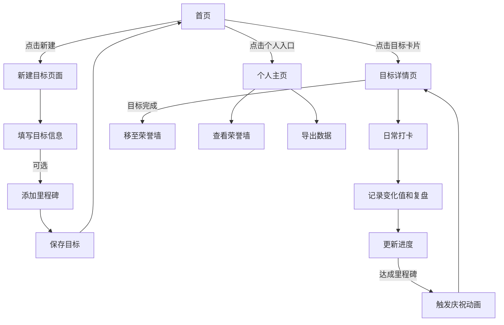

# 治愈系个人目标与进度管理 App（Lumina）产品需求文档

## 1. 产品概述
Lumina 是一款治愈系个人目标与进度管理应用，采用手帐风格设计，帮助用户建立积极的生活习惯，记录成长轨迹，减轻目标焦虑。
- 主要功能包括目标设定、进度追踪、里程碑奖励、复盘记录和数据可视化
- 目标用户为有自我提升需求但对传统任务管理工具感到压力的人群
- 产品价值在于通过治愈设计和正反馈机制，让目标管理变得轻松愉快

## 2. 核心功能

### 2.1 用户角色
| 角色 | 注册方式 | 核心权限 |
|------|----------|----------|
| 普通用户 | 本地使用（无需注册） | 全部功能，包括目标创建、进度追踪、数据导出 |

### 2.2 功能模块
1. **首页看板**：目标卡片展示、进度概览、个人主页入口
2. **新建目标页面**：目标类型选择、目标值设置、单位配置、里程碑添加
3. **目标详情页面**：进度展示、打卡记录、复盘笔记、历史轨迹、趋势图表
4. **个人主页**：荣誉墙展示、数据导出功能

### 2.3 页面详情
| 页面名称 | 模块名称 | 功能描述 |
|----------|----------|----------|
| 首页看板 | 目标卡片 | 展示所有进行中目标的进度、类型、当前值与目标值 |
| 首页看板 | 个人入口 | 点击进入个人主页，查看荣誉墙和进行数据导出 |
| 新建目标 | 目标表单 | 填写目标标题、选择类型（累积/趋势）、设置目标值、单位 |
| 新建目标 | 里程碑 | 可选择性添加里程碑，设置达成值和奖励文案 |
| 目标详情 | 魔法光球 | SVG 动画展示进度，50%和100%时触发彩蛋动画 |
| 目标详情 | 打卡区域 | 输入变化值、填写今日碎碎念（复盘笔记）、提交打卡 |
| 目标详情 | 历史轨迹 | 展示所有打卡记录，支持左滑撤销操作 |
| 目标详情 | 趋势图表 | 趋势型目标展示折线图，可视化进度变化 |
| 目标详情 | 心愿地图 | 横向滚动展示里程碑节点，已达成点亮 |
| 个人主页 | 荣誉墙 | 展示所有已完成目标，以勋章形式呈现 |
| 个人主页 | 数据导出 | 将所有目标和记录导出为 JSON 文件 |

## 3. 核心流程
用户主要流程包括：创建目标 → 日常打卡 → 查看进度 → 达成里程碑 → 完成目标。

## 4. 用户界面设计

### 4.1 设计风格
- **主色调**：莫兰迪色系，鼠尾草绿 (#8F9C82) 为主色，燕麦色 (#F9F8F4) 为背景
- **按钮风格**：大圆角 (24px)，无边框设计，柔和阴影区分层级
- **字体**：标题使用优雅的手写风格字体，正文使用易读的衬线字体
- **布局风格**：卡片式布局，大量留白，毛玻璃效果元素
- **图标风格**：简约 SVG 图标，线条柔和，与整体治愈风格统一

### 4.2 页面设计概述
| 页面名称 | 模块名称 | UI 元素 |
|----------|----------|---------|
| 首页看板 | 目标卡片 | 卡片式设计，大圆角，柔和阴影，进度条采用渐变色彩 |
| 新建目标 | 表单输入 | 无边框输入框，仅底部柔和下划线，手帐填空式设计 |
| 目标详情 | 魔法光球 | SVG 实现的毛玻璃球体，内部波浪动画，进度可视化 |
| 目标详情 | 历史轨迹 | 时间线布局，手写风格展示复盘笔记 |
| 个人主页 | 荣誉墙 | 勋章式布局，已完成目标高亮显示 |

### 4.3 响应式
- 移动端优先设计，适配各种屏幕尺寸
- 触摸交互优化，支持手势操作（如左滑删除）

### 4.4 动画设计
- 页面切换时平滑过渡动画 (ease-in-out 300ms)
- 魔法光球内部波浪持续流动动画
- 里程碑达成时的庆祝动画效果
- 卡片悬停时的微交互效果
